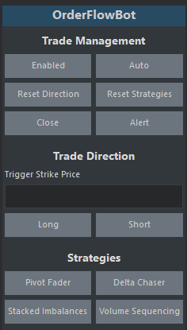
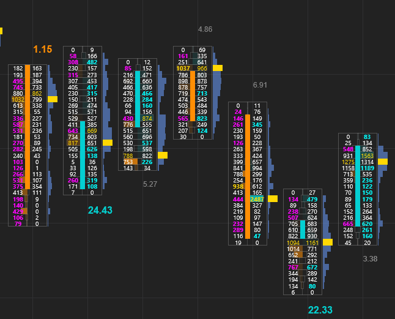
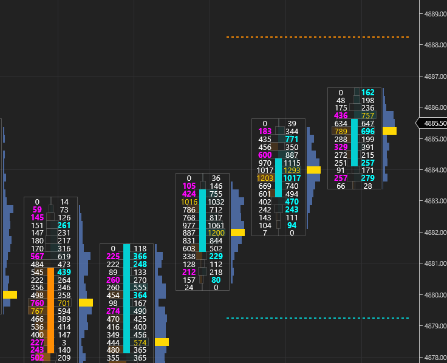
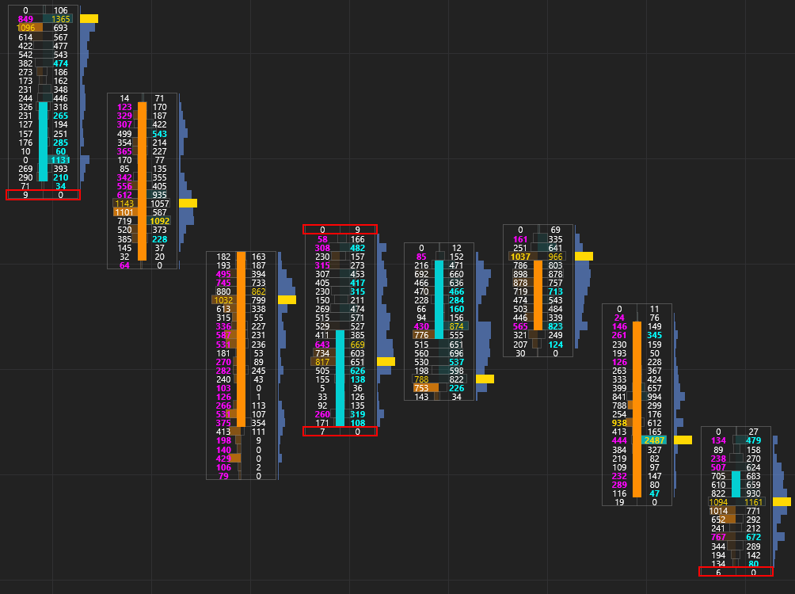
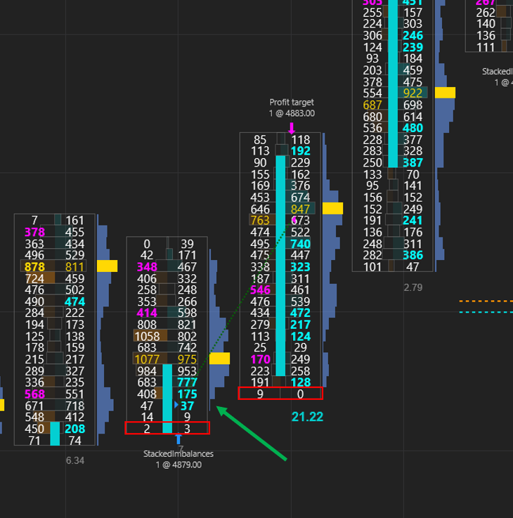
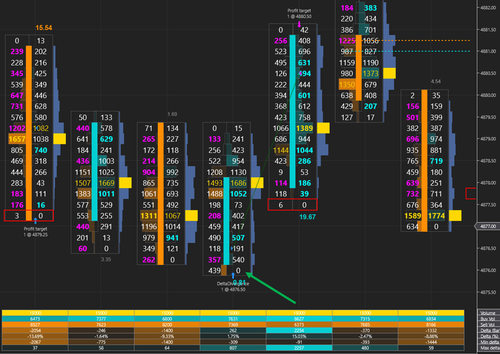
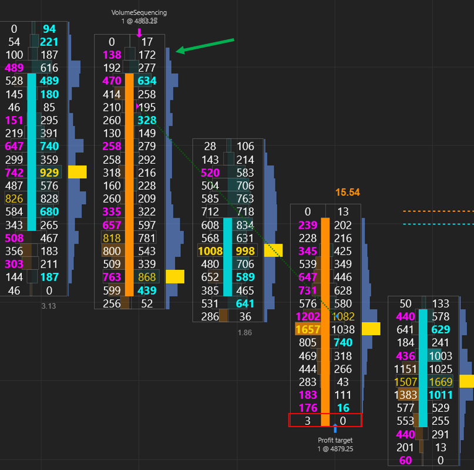

# OrderFlowBot

A bot used for trading order flow. The primary focus for OrderFlowBot is semi-automated trading. Strategies can be added and then manually selected for the software to look for entries. Indicators can also be added so they will startup when the OrderFlowBot strategy is enabled.

# Important

Requires the lifetime NinjaTrader license for the volumetric data

Make sure Tick Replay is Checked.

For developing, you can copy the OrderFlowBot folder into your local NinjaTrader AddOns folder.

For usage, you can download the zip containing the word import in the release page. You can import this zip file similar to importing a normal NinjaTrader Add-On. https://github.com/WaleeTheRobot/order-flow-bot/releases

# Development

A clean NinjaTrader 8.1.2.1+ install should have Newtonsoft in `C:\Program Files\NinjaTrader 8\bin`, but you can manually add it below if needed.

If you run into any issues about another assembly having a higher version of Newtonsoft, you can try removing the reference to it in the NinjaScript Editor similar to adding it below.

From NuGet add the following to NinjaTrader.Custom:

- Newtonsoft.Json

Right click the NinjaScript Editor and click References to add the following:

The version should match the installed version

- C:\Program Files\NinjaTrader 8\bin\Newtonsoft.Json.dll

The version should match the other added references. You might also need to add this.

- C:\\Windows\Microsoft.NET\Framework\v4.0.30319\netstandard.dll

# Usage

OrderFlowBot may not work if using a version of NinjaTrader below 8.1.2.1. This is the minimum version supporting features up to C# 8. The below are information about OrderFlowBot usage.

### ATM Strategy

OrderFlowBot uses an ATM Strategy. The default is called OrderFlowBot. This will be used when a strategy's requirements are met for entry. You will need to create an ATM Strategy and include it in OrderFlowBot options.

### Control Panel Buttons

The control panel buttons is disabled when backtesting is enabled.

Long - Use this with a selected strategy to look for a long entry.

Short - Use this with a selected strategy to look for a short entry.

Long and Short - Use this with a selected strategy to look for either a long or short entry.

Trend / Range - The default is Trend. Use this to select a Trend or Range market. Selecting trend will enter strategies as normal. Range will reverse the strategy. For example, if your strategy found a long entry with Range selected you will enter short instead of enter long.

Close - This closes the current position with the ATM without disabling OrderFlowBot. The default NinjaTrade Close button will disable the OrderFlowBot.

Strategies - Use a single or multiple strategies with the Long or Short button. Selecting multiple will look for an entry based on all selected strategies. It will enter based on the first valid strategy it finds.

### Backtesting

You can backtest your strategies by enabling the backtesting. This will use the target and stop where you enabled the backtesting. This will backtest all the strategies and can be a way to automate OrderFlowBot, but it is not the primary focus. To backtest a single strategy, you can just comment out the other strategies in the `OrderFlowBot/StrategiesIndicators/StrategiesIndicatorsConfig` file.

Selecting `JSONFileEnabled` when backtesting will create two JSON files called `orderflowbot-winning-trades.json` and `orderflowbot-losing-trades.json` to the desktop. This will have the values for the OrderFlowBot entry databar and databar before it so that they can be used for any further analysis.

# Included Indicators

The below indicators are included for OrderFlowBot and can be used as examples to add any other indicators. The indicators are not loaded like the standard NinjaTrader indicators. You will need to disable or enable them through the strategy since they use the data from the strategy.

### Ratios

Made popular by Mike from OrderFlows, this shows the bottom divided bid ratios or top divided ask ratios. The ratios will be displayed in color, bold and larger font if it meets the threshold in `ValidExhaustionRatio` or `ValidAbsorptionRatio` properies.

### Last Exhaustion Absorption Price

This shows the prices for the last valid exhaustion or valid absorption ratios for the bid and ask.

### Single Print

This draws a bold red rectangle for single prints on the top and bottom of the bar. You may need to adjust the bar width and bar width shift when using the volume profile for the bar. A bar width of 4 and bar width shift of 1.58 might be a good starting point to start adjusting for your chart.

# Included Strategies

The below are included for OrderFlowBot and can be used as an example to add any other strategies. Note that there is a check to not re-enter on the same bar in the main program so a strategy doesn't re-enter on the same bar. This will prevent multiple entries on a bar, to prevent any false entries.

### Stacked Imbalances

Long Position: Bullish bar with ask stacked imbalances.

Short Position: Bearish bar with bid stacked imbalances.

### Delta Divergence

Long Position: Bullish bar, positive delta and new low based on last number of LookBackBars.

Short Position: Bearish bar, negative delta and new high based on last number of LookBackBars.

### Volume Sequencing

Long Position: Bullish bar with sequential increasing volume on ask from bottom of bar.

Short Position: Bearish bar with sequential decreasing volume on bid from top of bar.

# Adding Strategies and Indicators

The custom DataBar should be used if you are considering adding strategies and indicators. It takes some of the data from the volumetric bars and creates custom bars that you can also add any additional information to.

- Add your strategy or indicator into the config `StrategiesIndicatorsConfigList` in `OrderFlowBot/StrategiesIndicators/StrategiesIndicatorsConfig` file.
- Create the class for your strategy or indicator and add it in `OrderFlowBot/StrategiesIndicators/Strategies/` or `OrderFlowBot/StrategiesIndicators/Indicators/`.
- The strategies are dynamically instantiated based on the config. Make sure to inherit the `StrategyBase` class similar to the `StackedImbalances` strategy.
- For an indicator, you can copy one of the existing indicators and make sure to also modify the NinjaScript generated code to reflect your indicator class. Go to `OrderFlowBot/OrderFlowBot` and add the option to enable or disable it in the `Indicators Properties`. Make sure to set the default value in `OnStateChange()` and add a check in `AddIndicators()`.

# Unit Testing

Not the greatest way to go about it, but essentially just copying over code and testing them with mock data. This is really just used to make sure some of the values are as expected.
