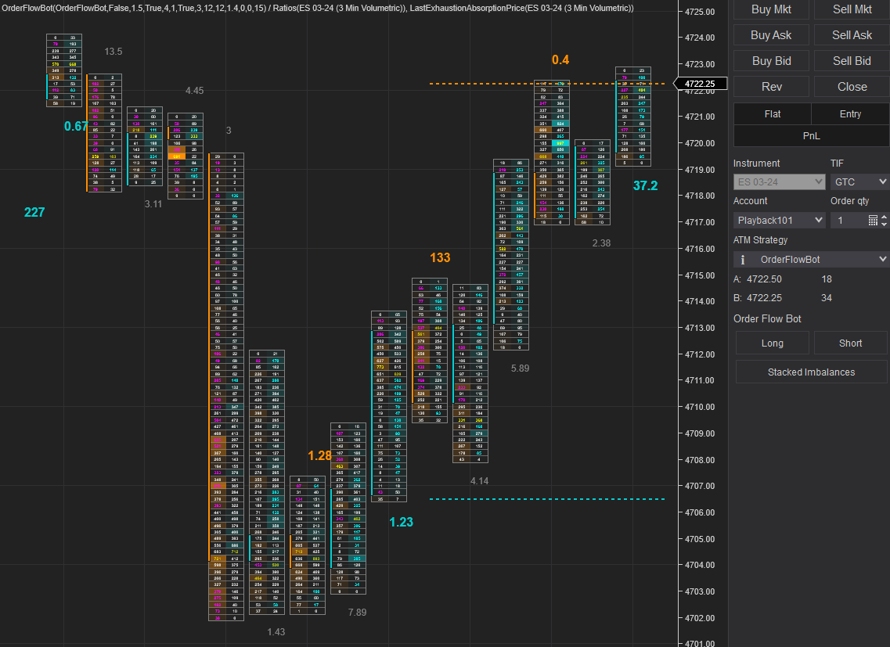

# OrderFlowBot

### Requires the lifetime NinjaTrader license for the volumetric data

A bot used for trading order flow. The focus for OrderFlowBot is semi-automated, but you can technically run your strategies fully automated with the backtesting enabled. Note that having the backtesting enabled will currently run all the strategies unless you only include a single strategy. You can also include any custom indicators so they will show when you enable the strategy.

# Included Indicators

The below indicators are included for OrderFlowBot and can be used as examples to add any other indicators.

### Ratios

Made popular by Mike from OrderFlows, this shows the bottom divided bid ratios or top divided ask ratios. The ratios will be displayed in color, bold and larger font if it meets the threshold in `ValidExhaustionRatio` or `ValidAbsorptionRatio` properies.

### LastExhaustionAbsorptionPrice

This shows the prices for the last valid exhaustion or valid absorption ratios for the bid and ask.

# Included Strategies

The below is currently the included strategy for OrderFlowBot and can be used as an example to add any other strategies. Note that there is a check to not re-enter on the same bar so a strategy doesn't re-enter on the same bar. This will prevent multiple entries on a bar, to prevent any false entries.

The Long and Short buttons are used with a selected strategy to look for long or short entries. Selecting both will look for both long and short entries. Selecting only one will look for that specific entry.

### Stacked Imbalances

This strategy looks if a bar is bullish or bearish and will enter if ask or bid stacked imbalances are found.

# Adding Strategies and Indicators

The custom DataBar should be used if you are considering adding strategies and indicators. It takes some of the data from the volumetric bars and creates custom bars that you can also add any additional information to.

- Add your strategy or indicator into `StrategiesIndicatorsConfigList` in `OrderFlowBot/StrategiesIndicators/StrategiesIndicatorsConfig` file.
- Create the class for your strategy or indicator and add it in `OrderFlowBot/StrategiesIndicators/Strategies/` or `OrderFlowBot/StrategiesIndicators/Indicators/`.
- The strategies are dynamically created. Make sure to inherit the `StrategyBase` class similar to the `StackedImbalance` strategy. The buttons for the strategies are also dynamically added.
- For an indicator, you can copy one of the existing indicator and make sure to also modify the NinjaScript generated code to reflect your indicator class. Go to `OrderFlowBot/OrderFlowBot` and add the option to enable or disable it in the `Indicators Properties`. Make sure to set the default value in `OnStateChange()` and add a check in `AddIndicators()`.

# Unit Testing

Not the greatest way to go about it, but essentially just copying over code and testing them with mock data. This is really just used to make sure some of the values are as expected.
