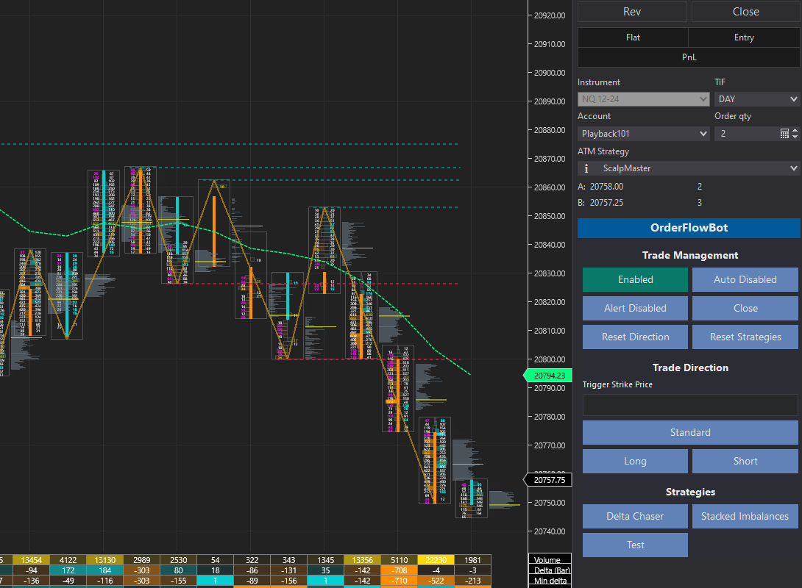

# OrderFlowBot

A bot used for trading order flow with a selected ATM strategy. The recommended way to use OrderFlowBot is semi-automated trading to **ASSIST** with entries, but fully automated is an option.

OrderFlowBot uses the selected ATM strategy. Just create your ATM strategies and select the one you want to use for the trade. You can create your own strategies and easily hook it to OrderFlowBot for semi-automated or fully automated trading. Indicators can also be created with data from the OrderFlowBot DataBar for usage when the OrderFlowBot is enabled.

Considering that there are some interest in this project, I would like to refactored this project some time and will probably not continue to contribute to this version. The work in progress branch will be in the dev-v3 branch. https://github.com/WaleeTheRobot/order-flow-bot/tree/dev-v3

# Important

Requires the lifetime NinjaTrader license for the volumetric data or the Order Flow + subscription.

Make sure Tick Replay is Checked.

Make sure you have ATM strategies.

OrderFlowBot may not work if using a version of NinjaTrader below 8.1.2.1. This is the minimum version supporting features up to C# 8. The below are information about OrderFlowBot usage.

Consider increasing the ticks per level in the data series for less liquid assets.

For developing, you can copy the OrderFlowBot folder into your local NinjaTrader AddOns folder.

For usage, you can download the zip containing the word import in the release page. You can import this zip file similar to importing a normal NinjaTrader Add-On. https://github.com/WaleeTheRobot/order-flow-bot/releases

# Issues

Sometimes NinjaTrader will complain about an import failed. You can just open the zip file from the release and copy the OrderFlowBot folder into the Add On folder on your computer after removing the previous OrderFlowBot folder. It's normally located at: `C:\Users\<username>\Documents\NinjaTrader 8\bin\Custom\AddOns`. Afterwards, open NinjaTrader and click `New` > `NinjaScript Editor`. Click the NinjaScript Editor and press `F5`. It'll take a few seconds and you'll hear a sound. The icon at the bottom left corner of it will disappear when it's done compiling. Close the NinjaScript Editor and you should be good to go.

# Control Panel

TODO

## Trade Management

This section has options to manage OrderFlowBot, quickly clear other sections and close a trade that was triggered from a strategy.

#### Enabled/Disabled

The Enabled/Disabled button is used for enabling and disabling trading. An ideal scenario to use this is during economic releases. You can click to disable so the bot doesn't check for entries.

- Enable/Disable trading
- Closes position entered from a strategy

#### Auto

Automatically trades the selected strategies for both long and short. This is **NOT** recommended, but is an option. Only custom created advanced strategies should be considered if this option is used. None of the default strategies available for OrderFlowBot are designed for fully automated trading.

- Disables Reset Direction
- Disables Trigger Strike Price, Long and Short
- Resets Trigger Strike Price, Long and Short

#### Alert

This is useful if you want to see your strategy entries, but want to further analyze for an actual entry. You can manually place the trade when it satisfies your requirements. Note that the close in the Trade Management section will not close manual entries.

- Does not submit an order
- Draws a triangle and plays sound based on triggered strategy

#### Close

Use this to close an ATM position triggered by a strategy.

- Closes ATM position triggered by a strategy
- Resets the Trigger Strike Price

#### Reset Direction

Resets the Trade Direction section.

#### Reset Strategies

Resets the Strategies section.

## Trade Direction

This section contains the options for triggering a trade direction. No entries will be considered if Long or Short options are not selected. Selecting both Long and Short options will enable the bot to look for both long and short entries.

#### Trigger Strike Price

The strike price to trigger the strategy to start looking for an entry. A threshold in the strategies properties section is set to allow for a buffer for triggering. The trigger strike price will only be considered if there is a value set in the input.

#### Standard/Inverse

This will enter with the default standard order or inverse. For example, if a strategy triggered long then a standard order will long the position. If inverse is selected then the strategy triggered long will short instead of long the position. This may be useful in range where the strategy is triggering but the market rejects and continues to the opposite direction.

#### Long

Select this to look for long trades.

#### Short

Select this to look for short trades.

## Strategies

This section contains the custom created strategies and are dynamically created from the `StrategiesConfig`. The strategies available are intended to be semi-automated, meaning you select the strategy you want OrderFlowBot to start looking at based on your analysis and OrderFlowBot will assist with finding entries based on the strategy. The default strategies here can be used as examples to create your own custom strategy. More strategies will be considered in the future. Note that a strategy will trigger when the requirements are met, but the requirement may become invalid before the bar completes.

#### Delta Chaser

This strategy is designed to enter a position based on the delta. Trade the structure with appropriate targets.

#### Long

- Bullish bar
- Delta > `DeltaChaserDelta`

#### Short

- Bearish bar
- Delta < -`DeltaChaserDelta`

#### Stacked Imbalances

This strategy is the common stacked imbalances strategy.

#### Long

- Bullish bar
- Open above trigger strike price if trigger strike price is used
- Has valid ask stacked imbalances

#### Short

- Bearish bar
- Open below trigger strike price if trigger strike price is used
- Has valid bid stacked imbalances

#### Volume Sequencing

This strategy is triggered based on the sequential increasing volume starting from the top or bottom.

#### Long

- Bullish bar
- Open above trigger strike price if trigger strike price is used
- Has sequential increasing volume on ask starting from the bottom of bar

#### Short

- Bearish bar
- Open below trigger strike price if trigger strike price is used
- Has sequential increasing volume on bid starting from the top of bar

## Entries

This does not allow multiple entries on the same bar. However, multiple entries may appear on the same bar when back testing even though it should be the next bar.

## Back Testing

You can backtest your strategies by enabling the backtesting. Entries uses the 1 tick data series for better granularity. You won't be able to use high resolution option.

## Adding Strategies and Indicators

The custom DataBar should be used if you are considering adding strategies and indicators. It takes some of the data from the volumetric bars and creates custom bars that you can also add any additional information to. The default strategies and indicators can be used as a reference.

## Advance

#### OrderFlowBotDataBar

This contains the information from the volumetric data and additional information such as checks for stacked imbalances, ratios, etc. You can use this to access the data to develop your own strategy.

#### Technical Levels

There is a class called TechnicalLevels that you can pass to your custom strategy for further analysis. There is an example in the strategy implementations folder called `PivotFader` that you can look at for example usage. It's not enabled and only exists for the example of using the technical levels. It includes a commmented out second data series (5 min). This has to be hard coded and not depdendent on run-time variables per NinjaTrader.

#### Pivots (Support/Resistance)

This is integrated from https://github.com/WaleeTheRobot/open-auto-trend-support-resistance. Add that as an indicator if you want to visually see the pivots. The last item in the list is the current developing pivot point. The second to the last is the last high or low pivot point.
